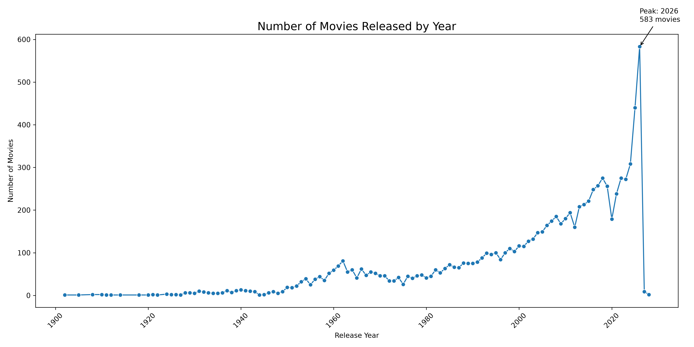
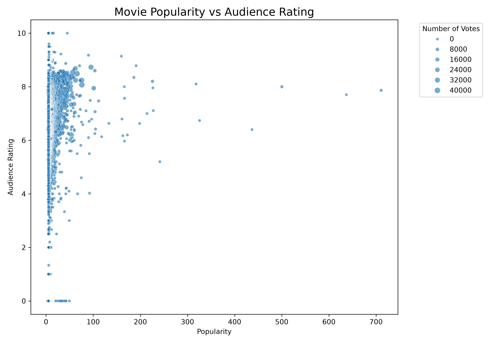
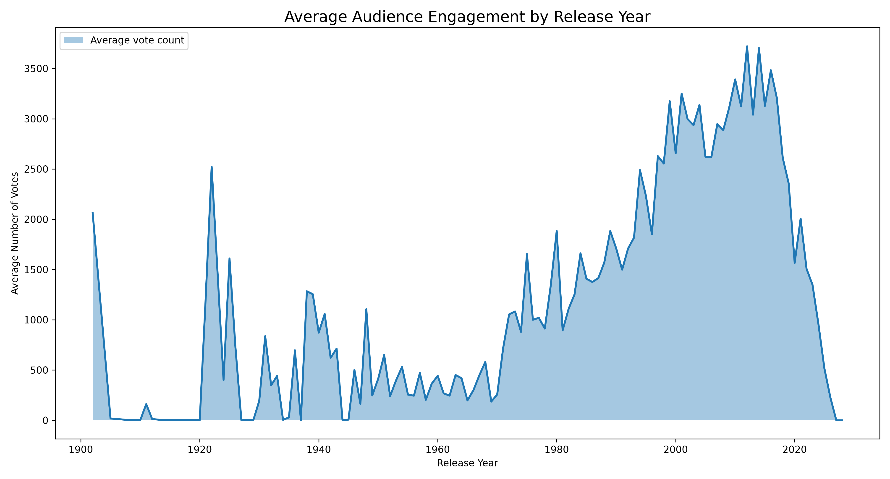
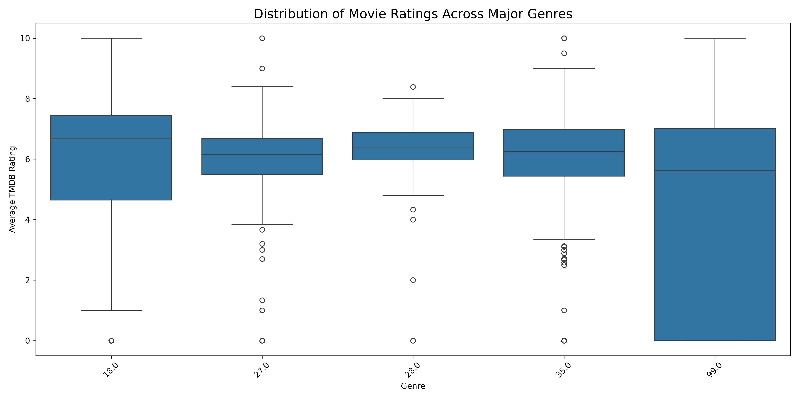
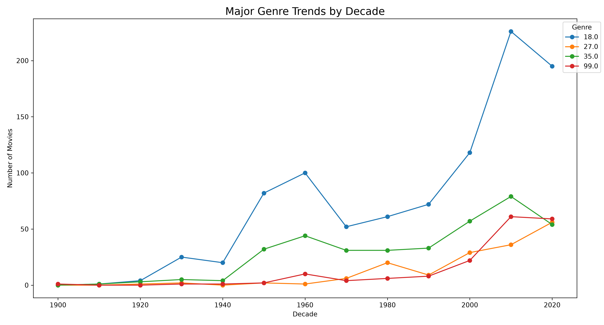
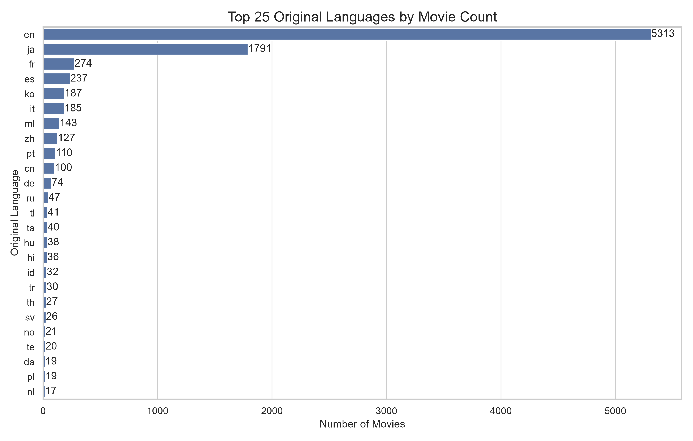
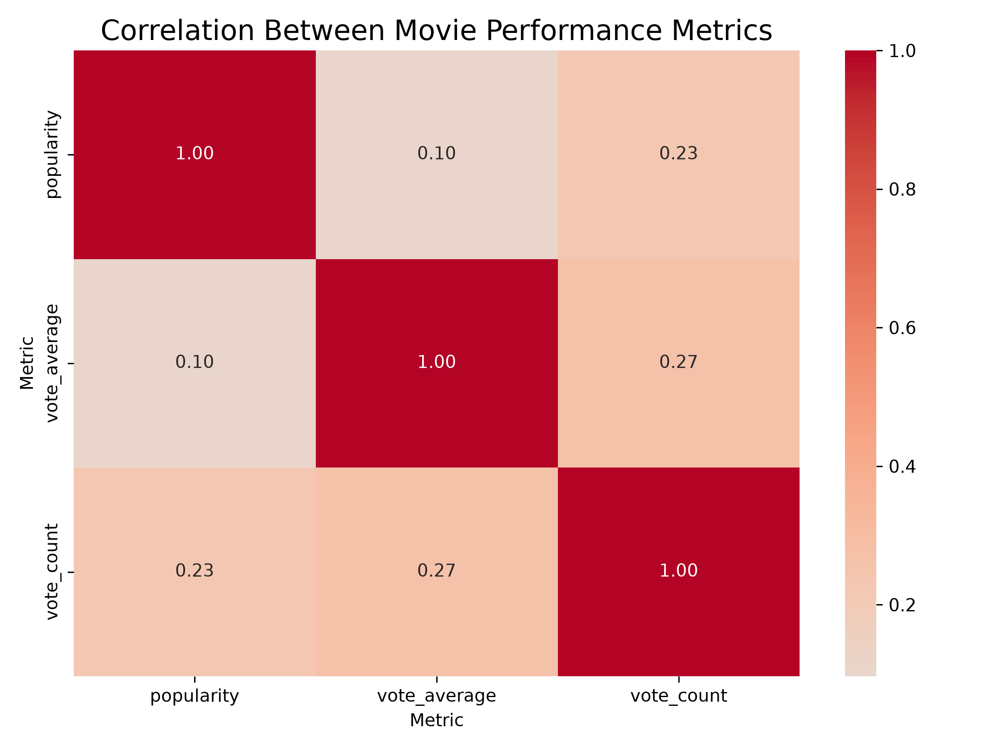
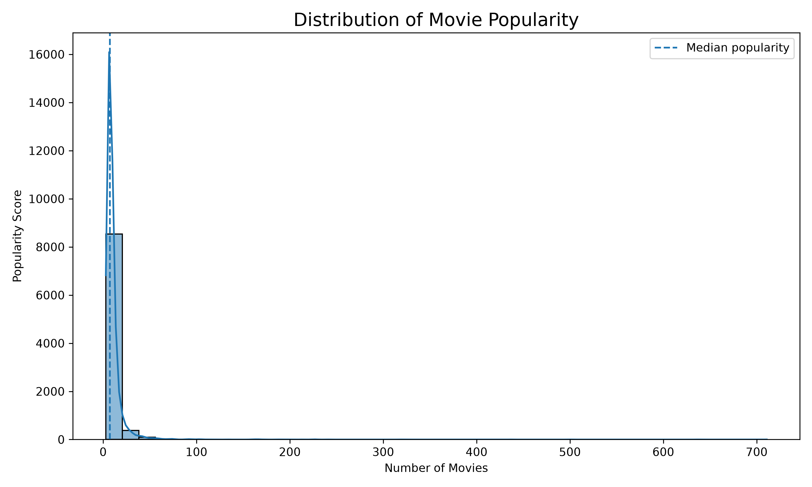

# tmdb-movie-tv-data-analysis
This project analyzes movie/TV data from the TMDB API 

Key Trends: Movie production shows a steady, exponential growth from the 1980s until peaking sharply in 2026.

Outliers: The year 2026 marks a massive, isolated peak at 583 movies, followed by an immediate, drastic crash in subsequent years.

Correlations: There is a strong positive correlation between time and the volume of movies released, indicating expanding industry capacity as technology progressed.

Potential Business Implications: The saturation up to 2026 suggests intense market competition, while the sudden drop indicates an incomplete database or severe market contraction.

Recommended Next Steps: Investigate the data collection process to verify if post-2026 data is simply missing or corrupted before making production investments.

#Business Question: Does audience engagement contribute to movie popularity?
Key Trends: The vast majority of movies are concentrated at a very low popularity score (under 50), with audience ratings primarily clustering between 5.5 and 8.5.

Outliers: A tiny handful of exceptionally high-popularity movies stretch across the x-axis between 400 and 700, maintaining relatively high audience ratings around 6.5 to 8.0.

Correlations: There is no strong linear correlation between popularity and audience rating, as highly rated movies exist at every popularity level, though highly popular movies rarely receive extremely low scores.

Potential Business Implications: Mass popularity is incredibly rare and driven by unique factors, meaning marketing budgets should focus heavily on a few breakout titles rather than expecting all films to scale equally.

Recommended Next Steps: Investigate the genres, release years, or budget sizes of the ultra-popular outliers (scores > 400) to understand what triggers viral global traction.

# Business Question: Has audience engagement with movies increased or decreased over time?
Key trends: Average audience engagement remains consistently low before 1970, after which it experiences a massive, steady climb that peaks during the 2010s digital streaming boom.

Outliers: An anomalous, sharp engagement spike occurs around the early 1920s, driven by a few highly rated cinematic classics (like Nosferatu or Metropolis) that drastically skew the historical average.

Correlations: There is a strong positive correlation between the modernization of cinema (post-1970s) and higher vote volumes, which abruptly drops off after 2020 due to recent releases accumulating fewer total lifetime votes.

Potential business implications: Studios and streaming platforms should focus marketing or remastering budgets on films from 1990 to 2020, as this window holds the highest established footprint for audience interest and retention.

Recommended next steps: Cross-reference this engagement data with historical box office revenue and genre trends to determine if high vote volumes directly translate to long-term profitability.

Key trends: Most genres maintain a consistent median rating between 6.0 and 6.7, except for genre 99.0 (Documentary) which shows extreme variance with its lower quartile stretching all the way down to 0.

Outliers: Highly concentrated outliers are visible across genres 27.0, 28.0, and 35.0(Horror, Action and Comedy simultaneously), highlighting numerous extreme high and low audience rating anomalies.

Correlations: Specific genres correlate strongly with rating predictability; for instance, genre 28.0(Action) has a very narrow box size, indicating highly consistent user reviews.

Potential business implications: Production studios can view genre 28.0(Action) as a safe, predictable investment, while genre 99.0(Documentary) presents a high-risk gamble due to highly polarized reception.

Recommended next steps: Analyze what specific elements triggered the 0 and 10 score outliers.

# Business Question: Which movie genres are becoming more or less prevalent over time?
Key Trends: Genre 18.0(Drama) consistently dominates movie production across almost every decade, experiencing exponential growth from the 1990s until its peak in 2010.

Outliers: Genre 18.0(Drama) shows a massive spike and sharp decline between 1990 and 2020, while Genre 35.0(Comedy) uniquely dips in 2020 while all other genres are rising.

Correlations: There is a strong positive correlation among all genres after 1990, as movie production volumes generally increased together across the board.

Potential Business Implications: Resources should remain heavily allocated toward Genre 18.0 due to its massive historic volume, but investment should shift toward Genre 27.0 and 99.0(Horror and Documentary) which show strong upward momentum in 2020.

# Business Question: Which original languages dominate the movie dataset?
Key Trends: English (en) heavily dominates the database, followed by Japanese (ja), while the vast majority of other original languages have fewer than 300 movies each.

Outliers: English is a massive extreme outlier with 5,313 movies, and Japanese is a secondary outlier with 1,791 movies, dwarfing all other categories combined.

Correlations: A strong disparity exists between major global/cinematic powerhouse industries (like Hollywood and Anime) and regional film markets regarding database volume.

Potential Business Implications: Streaming platforms relying on this data may face severe content gaps or localization bottlenecks if they try to diversify into non-English or non-Japanese regional markets.

Recommended Next Steps: License or invest more heavily in underrepresented regional languages like Spanish (es), Korean (ko), or Hindi (hi) to capture massive, untapped global streaming audiences.

# How strongly are movie ratings, popularity and audience engagement related?

Key trends: Metrics show positive but weak overall correlations, meaning a high score in one area does not guarantee a strong performance in another.

Outliers: There are no extreme outliers present in this matrix, as all values sit within a narrow, positive range between 0.10 and 0.27.

Correlations: The strongest relationship is between vote_count and vote_average (0.27), while the weakest is between popularity and vote_average (0.10).

Potential business implications: Higher movie ratings drive more audience engagement (votes) than generalized popularity campaigns, suggesting product quality outweighs raw buzz.

Recommended next steps: Invest in audience satisfaction and critical acclaim over superficial hype to organically grow a movie's lifetime engagement.

Key trends: Most titles follow a normal, bell-shaped distribution that peaks sharply around a 6.7 vote average, indicating generally positive to average viewer ratings.

Outliers: A massive, anomalous spike occurs at a 0 vote average, representing over 1,100 titles that are completely disconnected from the main rating distribution.

Correlations: Higher frequency strongly correlates with moderate ratings (5.5 to 7.5), showing that genuine viewer scores rarely fall at extreme highs or lows.

Potential business implications: The high volume of zero-rated titles likely distorts platform analytics, meaning unvoted or unreleased products are skewing recommendation engines and content metrics.

Recommended next steps: Filter out or isolate 0-rated titles from primary datasets before training recommendation algorithms or calculating true average performance metrics.

# Business Question: Is movie popularity evenly distributed, or are a small number of movies extremely popular?

Key Trends: The distribution is highly right-skewed (long-tail), meaning a vast majority of movies have very low popularity scores while only a select few achieve high popularity.

Outliers: A tiny fraction of blockbuster movies act as extreme outliers, extending far down the x-axis with a "Number of Movies" frequency near 0 but exceptionally high popularity scores compared to the rest.

Correlations: There is a strong negative relationship between volume and popularity, indicating that as popularity increases, the total count of movies achieving that status drops drastically.

Potential Business Implications: Streaming platforms and production studios should focus on a "blockbuster vs. long-tail" strategy, where a few high-performing hits drive massive traffic, but a massive library of niche titles is needed to sustain diverse viewer interests.

Recommended Next Steps: Segment the data to analyze the specific attributes of the high-popularity outliers (e.g., genre, budget, release season, or cast) to replicate their success factors in future productions.
    

